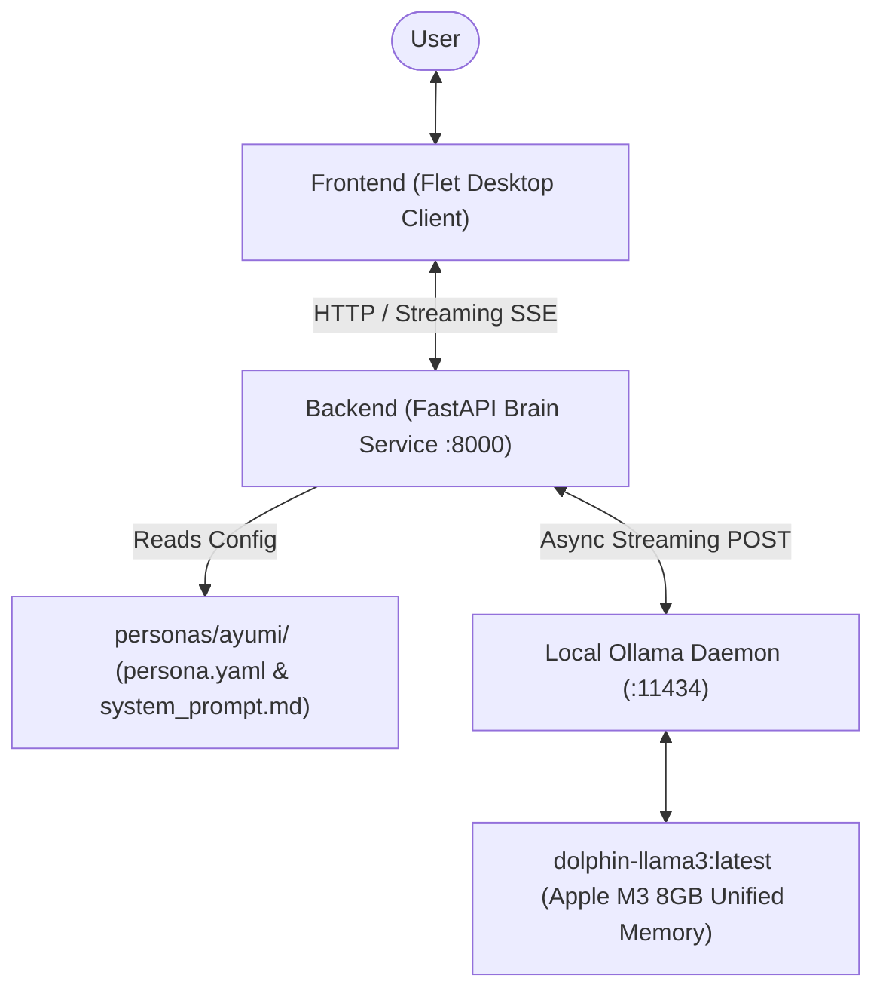

# Project Amica

An autonomous, interactive AI companion desktop application featuring decoupled architecture, asynchronous LLM token streaming, empirical hardware optimization for Apple Silicon, and declarative data-driven personas.

---

## Architecture Overview

Project Amica is built with a decoupled Client-Server architecture:
- **Brain (Backend - FastAPI)**: Microservice running at `http://127.0.0.1:8000`. Dynamically loads persona configuration from YAML/Markdown, enforces inference parameters calibrated for hardware headroom, injects system instructions, and streams tokens from local Ollama via ASGI `StreamingResponse`.
- **Face (Frontend - Flet / Flutter)**: Dark-mode desktop client featuring a 35/65 split-pane layout. Provides an interactive sprite stage placeholder, dynamic telemetry, typewriter token streaming with autoscroll, and non-blocking asynchronous UI updates.
- **Bootstrap (`run.py`)**: Master launcher managing concurrent service lifecycles, health polling, and clean SIGINT/SIGTERM process teardown.



---

## Project Evolution & Milestone Timeline

### Milestone v0.0: Hardware Benchmarking & M3 Profiling
*Commit: `53ba06e`*
- **Objective**: Establish empirical hardware baseline for local LLM inference on an Apple Silicon M3 MacBook Pro (8GB Unified Memory) before building the UI.
- **Implementation**: Built standalone diagnostic benchmark [`benchmark.py`](benchmark.py) evaluating `dolphin-llama3:latest` across context window sizes `[2048, 3072, 4096, 6144, 8192]`.
- **Key Findings** ([`benchmark_results.json`](benchmark_results.json)):
  - **Context 2048**: 145.57 prompt TPS, 18.24 gen TPS, 4.29 GB Ollama RAM.
  - **Context 3072**: **165.05 prompt TPS, 16.82 gen TPS**, swap stable (~3.2 GB). **Chosen as optimal operating point.**
  - **Context 4096+**: Memory pressure elevated, swap grew to ~3.9 GB, gen TPS dropped to 11.01 TPS at 8192 context.
  - **Decision**: Calibrated `num_ctx = 3072` and `num_predict = 200` to guarantee high responsiveness without memory thrashing.

---

### Milestone v0.1: The Living Core (Monolithic Client)
*Commit: `fd59fb8`*
- **Objective**: Create the foundational desktop application layout with direct local LLM connection and real-time streaming.
- **Implementation**:
  - Implemented initial desktop client in Flet (`app.py`) with Catppuccin Mocha-inspired dark palette.
  - Split-pane layout: Left stage (35% width) reserved for visual sprite stage / avatar silhouette and runtime telemetry; Right stage (65% width) interactive chat interface with user/assistant message bubbles.
  - Connected directly to Ollama REST API (`http://localhost:11434/api/chat`).
  - Implemented asynchronous typewriter streaming using `httpx.AsyncClient` with input locking during generation.
  - Configured Ayumi persona ("The Dragon Sage") with witty, sarcastic, tsundere personality traits.

---

### Milestone v0.2: Application Decoupling
*Commit: `cc17859`*
- **Objective**: Refactor monolithic client into a decoupled Client-Server architecture ("Brain" and "Face").
- **Implementation**:
  - **Directory Restructuring**:
    - `backend/main.py`: FastAPI service handling Ollama communication, parameter enforcement, and `StreamingResponse` token relay.
    - `frontend/app.py`: Dedicated Flet frontend client connecting to backend at `http://127.0.0.1:8000/api/chat/stream`.
  - **Master Boot Script (`run.py`)**: Launches Uvicorn backend and Flet frontend concurrently, polls `/health` before launching UI, and handles signal traps (Ctrl+C) for graceful dual-process teardown.
  - **Integration Testing**: Created `test_decoupled.py` verifying ASGI endpoints and live token streaming.

---

### Hardening & Bug Fixes
*Commit: `e0fd780`*
- **TextField Styling Deprecations**: Replaced deprecated `border_radius`, `border_color`, and `focused_border_color` in Flet with `ft.OutlineInputBorder` and `ft.ControlState`, eliminating all Flet 1.0+ warnings.
- **Chat Viewport Auto-Scroll**: Implemented `scroll_to_bottom()` coroutine triggered on chunk arrival and message submission to automatically track streaming responses.
- **Context Poisoning Protection**: Prevented connection errors from being appended to `message_history` as assistant turns.
- **Unmounted Focus Guard**: Hardened `focus_control()` with exception handling to prevent runtime crashes during window teardown.
- **Fail-Fast Backend Polling**: Enhanced `wait_for_backend()` in `run.py` to immediately detect child process exits (e.g. port conflicts) rather than waiting out the full timeout.
- **Edge Case Test Suite**: Added `test_edge_cases.py` testing HTTP 422 payload rejections and mock Flet layout assembly.

---

### Milestone v0.3: Data-Driven Persona
*Commit: `ec83a11`*
- **Objective**: Decouple personality definitions and generation parameters from Python source code into declarative configuration files.
- **Implementation**:
  - Created declarative directory `personas/ayumi/`:
    - [`personas/ayumi/persona.yaml`](personas/ayumi/persona.yaml): Defines metadata, model ID (`dolphin-llama3:latest`), temperature (`0.7`), context window (`3072`), and predict limit (`200`).
    - [`personas/ayumi/system_prompt.md`](personas/ayumi/system_prompt.md): Defines behavioral persona and conversational constraints.
  - **Backend Refactor**:
    - Added `load_persona()` with robust fallback defaults for missing or unreadable YAML/Markdown files.
    - Dynamically applies parameters from `PERSONA_CONFIG` to Ollama requests.
    - Automatically injects `system_prompt.md` at index 0 on `POST /api/chat/stream`, filtering any client-side system messages.
    - Added `GET /api/persona` and enriched `GET /health` with persona metadata.
  - **Frontend Refactor**:
    - Removed all hardcoded system prompts from `message_history` and `clear_chat`. The frontend now exclusively manages user/assistant turns.
    - Added asynchronous synchronization (`sync_persona_metadata`) updating window title, headers, hints, and telemetry cards dynamically from the active backend persona.
  - **Dependencies**: Added `pyyaml>=6.0.0` to `requirements.txt`.

---

## Directory Structure

```text
Project_Amica/
├── backend/
│   ├── __init__.py
│   └── main.py             # FastAPI Brain Service (port 8000)
├── frontend/
│   ├── __init__.py
│   └── app.py              # Flet Desktop Client Face
├── personas/
│   └── ayumi/
│       ├── persona.yaml    # Declarative parameters (model, temp, ctx, predict)
│       └── system_prompt.md # Declarative system persona prompt
├── benchmark.py            # Hardware sweep & diagnostic profiler
├── benchmark_results.json  # Empirical benchmark metrics for Apple M3
├── requirements.txt        # fastapi, uvicorn, flet, httpx, pyyaml
├── run.py                  # Concurrent launcher & process lifecycle manager
├── test_core.py            # Direct Ollama API streaming verification
├── test_decoupled.py       # FastAPI ASGI & streaming integration tests
└── test_edge_cases.py      # Validation, fallbacks, and layout test suite
```

---

## Setup & Running Locally

### 1. Prerequisites
- macOS (Apple Silicon M3 or compatible)
- Python 3.11+
- [Ollama](https://ollama.com/) running locally with model installed:
  ```bash
  ollama run dolphin-llama3:latest
  ```

### 2. Installation
```bash
python3 -m venv .venv
source .venv/bin/activate
pip install -r requirements.txt
```

### 3. Launching Project Amica
Launch both the FastAPI backend and Flet desktop frontend with the master boot script:
```bash
python run.py
```
*Note: Press `Ctrl+C` in the terminal to gracefully terminate all services.*

---

## Running the Automated Test Suites

```bash
# 1. Edge Case, Fallback & Layout Resilience Suite
python test_edge_cases.py

# 2. Decoupled Architecture & Persona Integration Suite
python test_decoupled.py

# 3. Core Direct Ollama Connection Suite
python test_core.py
```
